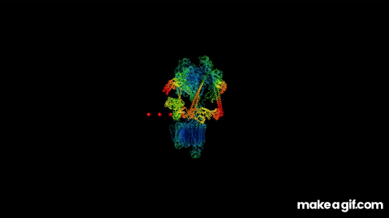

# Purpose and Background
This is a repository made to demonstrate the function of the V-ATPase protein complex, a complex that the ATP6V0A1 gene contributes towards, which is the focus of my undergraduate thesis.

This repository visually demonstrates the mechanics of the human V-ATPase protein complex (PDB 6WM2). This complex functions as a proton pump that transports protons from a cell's cytoplasm through a lipid bilayer and into a subcellular compartment. It functions by incrementally rotating protons between two distinct entry and exit tunnels from within the membrane, generating roation through the hydrolysis of ATP molecules.

During the function of the V-ATPase, the hydrolytic portion rotates counter-clockwise 120-degrees per each hydrolysis of ATP. This causes the 'rotor' within the membrane, which transports protons, to rotate in a delayed set of 36-degree increments that do not perfectly align with the hydrolytic portion's rotation. There are 10 total binding spots for protons, where each 36-degree rotation transports one proton, so one 120-degree rotation will average 3.33 protons transported at maximum efficiency. For more information on the function of the V-ATPase and the context in which my lab is studying it, please see reference #1 below.1 For more information regarding the V-ATPase's specific rotation and mechanics, please see reference #2 below.2

# Modeling Limitations
This visualization is intened to demonstrate the general mechanism of the V-ATPase and is not a quantitatively acurate molecular simulation. Several elements of this process have been simplified for clairy including: the size of protons, which specific subunits do and do not rotate, the lack of ATP in the visualization, and the linear movement of protons. Additionally, this visualization moves all rotating components in 36-degree increments to reduce the complexity of the rotation coupling between the cytoplasmic and transmembrane domains.

# How to Use this Repository
## Requirements
This repository requires PyMOL and Python.

## Setup
To use this repository, please install PyMOL and clone this repository. Then, open PyMOL and run the 'main.pml' file. This should create a folder in the same directory called 'Frames' that contains all of the frames of the simulation at 30 fps. These frames can then be compiled into a movie using a video editing software. To configure the duration of the simulation, open the 'config.py' file and alter the run_time variable to be your desired duration in seconds.

# References
1. Lin Y, Tan Z, Ye W, Li W, Chen H, Lin Y, Zhou M, Liu H, Liu Q, Zhang Z, Kong W, Xu Z, Lin H, Mo M, Guo W, Lin K, Tang J, Zheng Y, Zhang W, Xu P, Chen X. ATP6V0A1 protects dopaminergic neurons via the autophagy-lysosomal pathway in Parkinson's disease. Neural Regen Res. 2026 Aug 1;21(8):3797-3806. doi: 10.4103/NRR.NRR-D-24-01420. Epub 2025 Jun 19. PMID: 40537015; PMCID: PMC13452720.
2. Otomo A, Iida T, Okuni Y, Ueno H, Murata T, Iino R. Direct observation of stepping rotation of V-ATPase reveals rigid component in coupling between Vo and V1 motors. Proc Natl Acad Sci U S A. 2022 Oct 18;119(42):e2210204119. doi: 10.1073/pnas.2210204119. Epub 2022 Oct 10. PMID: 36215468; PMCID: PMC9586324.